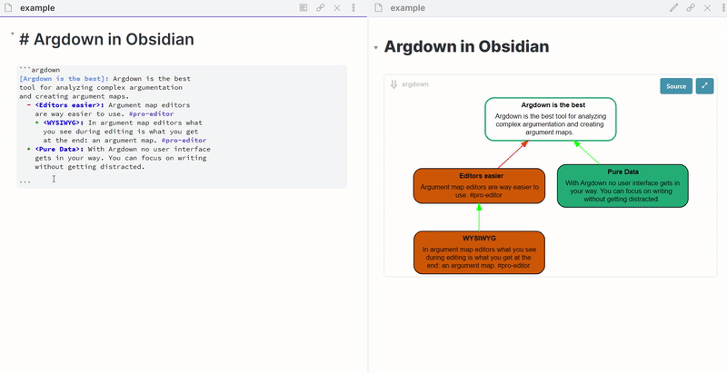

# Argument Map with Argdown in Obsidian
**NB** You must have Argdown cli installed. See https://github.com/christianvoigt/argdown/tree/master/packages/argdown-cli for instructions. I'm working on bundling Argdown with this plugin, but for now that's not the case.

## Features
* syntax highlighting
* start codeblocks with argdown or argdown-map 
* view your maps in the Preview Pane

## Demo


## How to Use
Remember, you need to have [Argdown cli](https://github.com/christianvoigt/argdown/tree/master/packages/argdown-cli) installed.

Add an Argdown codeblock to your note and just start typing. The preview will automatically update.
````markdown
```argdown 
[Statement]: this is a statement
    + pro one
    + pro 2
    - con 1
```
````
or 
````markdown
```argdown-map
[Statement]: this is a statement
    + pro one
    + pro 2
    - con 1
```
````
